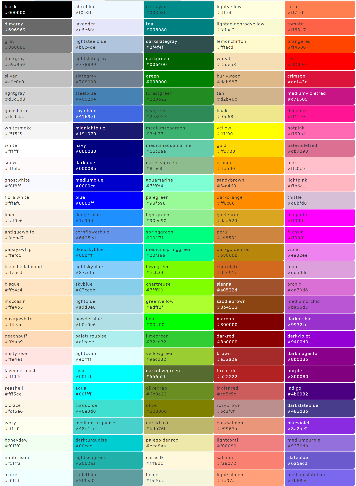

# Man10 Resource Pack
シーズン３用リソースパック

| どのアイテムに割りあてるか | カテゴリ名(modles/texturesの名前) | 用途                                     |
| -------------------------- | --------------------------------- | ---------------------------------------- |
| wooden_hoe                 | hat                               | 帽子、頭につけるもの                     |
| iron_hoe                   | weapon/gun                        | 銃                                       |
| iron_sword                 | weapon/sword                      | 近接武器、剣など                         |
| iron_shovel                | weapon/magic                      | 手にもつ魔法武器、杖など                 |
| potion                     | drink                             | 飲み物                                   |
| baked_potato               | food                              | 食べ物                                   |
| stone_hoe                  | equipment                         | 設備・家具類（地面のおくこと前提）       |
| golden_hoe                 | gadget                            | ガジェット類（地面（額縁）におけること） |
| iron_nugget                | slot                              | スロット図柄                             |
| oak_sapling                | virtucalblock                     | バーチャルブロック                       |
| gold_nugget                | number                            | 数字                                     |
| golden_shovel              | veheicle                          | 乗り物、自転車、車など                   |
| wooden_shovel              | icon                              | discrodアイコンなどUIに使うもの          |
|                            |                                   |                                          |

#### ディレクトリ構造について

- sounds(音)
- models
  - block(マイクラ従来ブロックを置き換えるとき)
  - item(マイクラ従来のアイテムを置き換えるとき)

  - man10(カテゴリはtextureと同等にします)
    - common
    - food
    - fish
    - item
    - weapon
      - gun
      - other
      - sword
      (続く,,texturesと同等)
- textures
  - block (マイクラ本来のテクスチャを置き換えるとき)
  - man10
    - currency (通貨アイテム・ガチャコインなど)
    - common (共通化できるテクスチャ)
    - fish　(魚)
    - food (食べ物)
    - drink(飲み物
    - drug(薬
    - tool（ペンチとか手にもつ道具)
    - hat(頭にかぶるもの)
    - glasses(眼鏡とか)
    - slot(カジノのスロットとか)
    - equipment(設備 ATMや機械など)
    - gadget(小物、mPhoneとかちょっとしたもの)
    - icon(ディスコードアイコンなどのアイコン)
    - number(数字)
    - letter(文字)
    - virtialblock(オークの苗木)
    - drug(薬) 
    - other　(あてはまらないもの)
    - weapon
      - magic (魔法)
      - gun　(銃)
      - sword（剣)
      - other （その他)

#### ルール

- models/ 以下には、jsonファイル以外は置かない。
- textures/ 以下には、pngとmcmetaファイル以外は置かない。
- modelsとtextureのカテゴリ名は一致させること
- commons以外のtextureファイルには必ずmodelのフォルダを作り、どのモデルから参照されてるかわかるようにすること

#### 例

pistoldemo というテクスチャを作るときの例です。

運営以外は、テクスチャはモデルと同じ名前のフォルダを作って、その下にファイルをいれてください。

ファイル名は自由ですが、わかりやすい名前をいれること。当たり前ですが、漢字や全角はダメ。

[モデル]

- /models/man10/weapons/guns/pistoldemo.json

[テクスチャ]　モデル名と一致するフォルダを作る

　* /textures/man10/weapos/guns/pistoldemo/frame.png
  * /textures/man10/weapos/guns/pistoldemo/barrel.png

これらの組み合わせをセットとする

シーズン２最終データより必要なものを取り込むようにします

割り当て表

https://docs.google.com/spreadsheets/d/1Qjq2OjKzGZb6t3sb2Cl7Ph7B5xoYvHFCcLdMqbBAuiQ/edit#gid=1509554362

Wiki

https://man10.red/wiki/doku.php?id=helper:%E3%83%AA%E3%82%BD%E3%83%BC%E3%82%B9%E3%83%91%E3%83%83%E3%82%AF%E5%86%8D%E7%B7%A8

## プライマリカラーについて

テクスチャパックには共通で使える色のテクスチャがはいっています
単色で色を使いたい場合は個別にカラーテクスチャを追加するのではなく、下のカラーの表から色を選びましょう

/man10/common/red   ->  ■

/man10/common/springgreen   ->  ■

プライマリーカラーのほかにgray0(白) - gray15(黒）やrainbowなど共通して使えそうな色がいろいろはいっています。
色を追加するまえにまずこのフォルダの中から使える色があるか確認しましょう

## バーチャルブロックについて

バリアブロックに光る看板をつけて、そこにバーチャルブロックをいれると、ブロックとして使えます。
既存のブロックテクスチャに影響を与えず、ブロックを追加することができます

## master
マスターブランチです。正式公開されたバージョンをここにいれます。

## develop
開発中のブランチです。

基本はこのブランチを追いかけてください

このブランチをチェックアウト後、自分のブランチを作成して作業してください。
ブランチ名は
MCID/ブランチ名

[例] takatronix/xxxx
